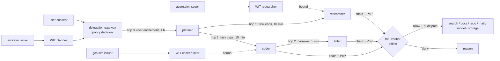

# AEGIS NEXUS

**Holder-bound, attenuating delegation for multi-cloud AI-agent workloads, and a measurement of how much
authority leaks when one piece of the chain is compromised.**

An agent calls tools, and increasingly hands work to sub-agents that call more tools, often in other clouds.
The credential that travels with the work is usually a static API key, the caller's own workload identity
with a broad role, or an OAuth token that is exchanged hop by hop without narrowing. None of these says
*this workload, on behalf of this user, may do this task, here, for the next ten minutes*, so a stolen token
or a compromised sub-agent carries far more authority than the task needed.

AEGIS NEXUS builds a **Delegation Attestation Chain (DAC)**: every hop is a signed link that can only narrow
capabilities and lifetime, is bound to the holder's key (each request carries a proof of possession), and is
bound to the holder's workload identity token issued by that workload's own trust domain (one per cloud).
It then measures **Delegation Leakage Surface (DLS)**: the weighted authority an attacker can still use after
a compromise, integrated over time (weight x hours), against three baselines and two ablations.

> v0.1 research prototype. Everything is local and simulated: three mock trust domains stand in for
> SPIFFE/cloud workload identity, keys are test-only, no cloud account. All numbers are from a synthetic
> scenario set and are regenerated by the commands below.



## Evidence

**DLS benchmark** ([`reports/benchmark.md`](reports/benchmark.md)): 26 compromise scenarios (stolen tokens,
compromised tools, replay after revocation, compromised or prompt-injected sub-agents, over-broad
delegation and lifetime extension, wrong environment, stolen signing keys, outsider forgery, and one
negative case), 22 weighted authority targets, 30 legitimate cross-cloud tool calls, 90-day horizon.
Negative case excluded from the summary:

| Credential model | Total DLS | Median DLS | Scenarios with DLS 0 | Legit calls allowed | Audit path complete |
|---|---|---|---|---|---|
| Static API key (baseline) | 3,932,550.6 | 241,918.13 | 3 | 30/30 | 0/30 |
| Workload identity federation, broad roles (baseline) | 149,971.58 | 27.53 | 3 | 30/30 | 0/30 |
| RFC 8693 token exchange, no attenuation (baseline) | 242,782.01 | 49.17 | 3 | 30/30 | 30/30 |
| DAC without attenuation (ablation) | 311.68 | 0 | 17 | 30/30 | 30/30 |
| DAC without holder binding, bearer chain (ablation) | 91 | 0.47 | 5 | 30/30 | 30/30 |
| **DAC** | **7.06** | **0** | **17** | 30/30 | 30/30 |

What the ablations show is the useful part. **Holder binding** is what zeroes token theft: with it, every
stolen-token, compromised-tool, replay and wrong-environment scenario is 0 (DAC and DAC-without-attenuation
alike); without it the attenuated chain still leaks in those families (stolen token 54.84, compromised
tool 28.47, replay after revocation 0.63). **Attenuation** is what bounds a compromised
holder: an exfiltrated linter key and token (S20) gives 49.17 without attenuation (the root's authority for
the root's lifetime) and 0.13 with it (the linter's one read target for its remaining 4 minutes).

**Negative case** (S26: the root planner workload is compromised while its credential is valid, detected
after 4 h): DAC 200, RFC 8693 200, workload identity 469.97, static key 448. DAC does **not** bound this;
attenuation only narrows authority below the compromised hop, and the root can renew until detection.

**How much of this is by construction.** Given the modelled lifetimes and scopes, each DAC number is exactly
"compromised holder's task weight x its remaining delegation lifetime", and each baseline number follows
from its stated assumption (listed in the report). The benchmark does not discover that short, narrow,
key-bound tokens leak less; it checks that a real verifier actually enforces that against an attacker who
tries every artifact it holds, and it attributes the gap to the individual properties. The static key's
totals are dominated by its 90-day lifetime; medians are the fairer comparison.

The verifier is covered by negative tests, one per check (signature, `alg`/`typ` confusion, expiry, future
`iat`, trust domain, cross-domain issuer, gateway, splice, depth, principal/env/policy change, WIT binding,
widening, lifetime extension, revocation cascade, policy retirement, missing/foreign/stale/replayed PoP,
malformed input) in [`tests/test_dac.py`](tests/test_dac.py).

## Quickstart

Needs Python 3.10+.

```bash
python -m venv .venv && . .venv/bin/activate      # Windows: .venv\Scripts\activate
python -m pip install "pyjwt>=2.10,<3" "cryptography>=44" "pytest>=8"
python -m pytest -q
python -m aegis_nexus demo                  # mint a chain, show what it allows and why the rest is denied
python -m aegis_nexus bench --out reports   # the DLS benchmark, about 15 s
```

Dependencies: `cryptography` (Ed25519, audited OpenSSL-backed primitives) and `PyJWT` (JWS encoding and
`alg` handling). No signature code is written here.

## How it works

- **WIT** ([`aegis_nexus/dac.py`](aegis_nexus/dac.py)): a workload identity token in the style of IETF
  WIMSE workload credentials: SPIFFE ID, environment, and the workload's public key (`cnf`), signed by the
  issuer of the trust domain in the SPIFFE ID. A tool trusts each issuer only for its own domain.
- **Link**: hop 0 is signed by the delegation gateway (user, entitlement, policy version); hop i is signed
  by hop i-1's holder key and names it by RFC 7638 thumbprint. Each link carries `obo`, `cap`
  (`tool:action:resource`, trailing `*` = prefix), `env`, `pv`, `exp`, `del_depth`/`del_max_depth`,
  `par_hash` (hash of the parent link) and `wit_hash` (hash of the holder's WIT).
- **PoP**: for each request the leaf signs tool, action, resource, token hash, time and a nonce. Tools keep
  a replay cache and a 60 s window.
- **Verifier**: fully offline at the tool. Every hop's signature, liveness, binding and monotonicity is
  checked; any parse error is a denial. Revocation is "this workload's links issued before t", checked on
  every hop, so revoking a parent kills its descendants.
- **DLS** ([`aegis_nexus/bench.py`](aegis_nexus/bench.py)): for each scenario and model, the attacker's
  loot is assembled (tokens, keys, captured requests, refresh ability until detection, stolen signing keys)
  and every target is attempted with real requests. Success only changes when a credential is issued,
  expires or is revoked, so the time integral is exact when evaluated once per interval between those
  points; a test checks the answer is constant inside each interval.

## Prior art and what is not new

The delegation chain itself is not new. Before building, these were checked:

- **Macaroons** (Birgisson et al., NDSS 2014): caveat-based attenuation, HMAC chains, bearer tokens.
- **Biscuit** (Eclipse Biscuit; `biscuit-python` 0.4): public-key, offline attenuation with Datalog
  policies. Tokens are bearer by default. This is the "DAC without holder binding" ablation's model.
- **UCAN 1.0**: capability delegation chains with attenuation between key-identified principals; the
  invoker signs, so authority is holder-bound.
- **Attenuating Authorization Tokens** (draft-niyikiza-oauth-attenuating-agent-tokens, March 2026) and its
  implementation **Tenuo** (Apache-2.0, v0.3.1): holder key in `cnf`, PoP per call, `par_hash`, depth
  limit, monotone expiry and capabilities, offline verification, aimed at AI agents. DAC's link invariants
  follow this draft; **the link format and its checks are this draft's, not this project's.** The draft
  deliberately leaves workload identity to WIMSE.
- **draft-hamr-oauth-agent-delegation-02** (September 2026): narrowing scope/expiry chains for agents in an
  HTTP header. **RFC 8693** token exchange (`act`), **RFC 9449** DPoP, **RFC 8705** mTLS-bound tokens,
  **RFC 7800** `cnf`. **IETF WIMSE** (workload identity tokens with `cnf`, workload proof tokens),
  **SPIFFE/SPIRE** JWT-SVIDs, and **AWS Bedrock AgentCore Identity** (per-agent workload identities used
  to obtain access tokens; the page we read describes no attenuating chain).
- Measurement: *Delegation Without Trust* (arXiv 2609.00267, 2026) already measures what a compromised
  sub-agent can reach under bearer vs brokered delegation (1.5 vs 8,100 reachable actions over 2,000
  randomized scenarios), and *Optimizing Credential Blast Radius* (arXiv 2609.04566, 2026) defines blast
  radius as weighted impact after compromise. DLS is a time-integrated variant of the same idea.
- The papers the project was seeded from resolve and are about workload authentication, not delegation:
  *A Multi-Cloud Framework for Zero Trust Workload Authentication* (Deochake, Murphy, Gearheart; ACSAC
  Workshops 2025) and *SPIFFE-Based Zero-Trust Authentication for AI Agent Ecosystems* (Pappu, Bhushan,
  Mittal; ICCA 2025). Metadata was checked via Crossref; full texts were not read.

**Why not build on Biscuit or Tenuo.** The benchmark needs one verifier whose checks can be switched off one
at a time (attenuation, holder binding) and that composes with JWT-SVID/WIMSE-style identity tokens. The whole
mechanism is about 260 lines on PyJWT; wrapping Biscuit would still need a PoP layer and a JWT bridge. For production
use, Tenuo, UCAN or Biscuit plus a PoP scheme is the better starting point.

**What remains:** (1) binding every hop, not just the root, to a workload identity token from that hop's own
trust domain, together with environment and policy-version fields, which is a small composition of the AAT
draft and WIMSE; (2) a reproducible, time-integrated comparison across three common baselines with
ablations that attribute the leakage reduction to individual properties, including a negative case. This is
an engineering and measurement contribution, not a new protocol.

## Limitations

- **Synthetic and simulated.** One invented deployment (4 agents, 6 tools, 22 weights, chosen lifetimes).
  The absolute numbers are functions of those choices; change the TTLs and the numbers move proportionally.
- **Baselines are modelled, not deployed.** Each baseline's behaviour is an explicit assumption (shared
  org-wide static key, broad per-workload roles, no environment claim in baseline tokens, RFC 8693 scope
  copied and `exp` clamped to the subject token). A stricter real deployment of any baseline would leak less.
- The attacker is the coded strategy in `Attack`, not an adversarial search.
- No SPIRE, no cloud workload identity, no OPA/Cedar, no Docker/Kubernetes: the project README's minimum
  system asked for these, and v0.1 replaces them with in-process simulation. The capability subset check
  plays the policy role.
- Revocation and the PoP replay cache are in-memory per tool; distributing them is the hard part in real
  systems and is not modelled. Detection is a fixed delay.
- Composite compromises (gateway key plus a workload key, issuer key plus a parent key) are not benchmarked;
  the threat model says what they would give.
- Verification latency (median 973.5 us per cold DAC check on the provenance machine, versus 208.5 us for
  RFC 8693) is pure Python + PyJWT, unoptimised and machine-dependent.

## Layout

```
fixtures/world.json         synthetic deployment, targets, legit calls, 26 scenarios (the benchmark input)
aegis_nexus/dac.py          the mechanism: WIT, links, PoP, offline verifier
aegis_nexus/models.py       static key, workload identity, RFC 8693, DAC and its two ablations
aegis_nexus/bench.py        attacker, exact DLS integration, reports, provenance
tests/                      verifier negative tests, benchmark checks
docs/THREAT_MODEL.md        what DAC stops, what it does not
reports/                    generated evidence (JSON + Markdown)
```

## Next (v0.2)

SPIRE-issued JWT-SVIDs in place of the mock issuers, Azure federated identity and AWS STS adapters, OPA or
Cedar for the gateway's hop-0 decision, OpenTelemetry spans carrying the chain's audit path, distributed
revocation, and composite-compromise scenarios.

MIT licensed.
